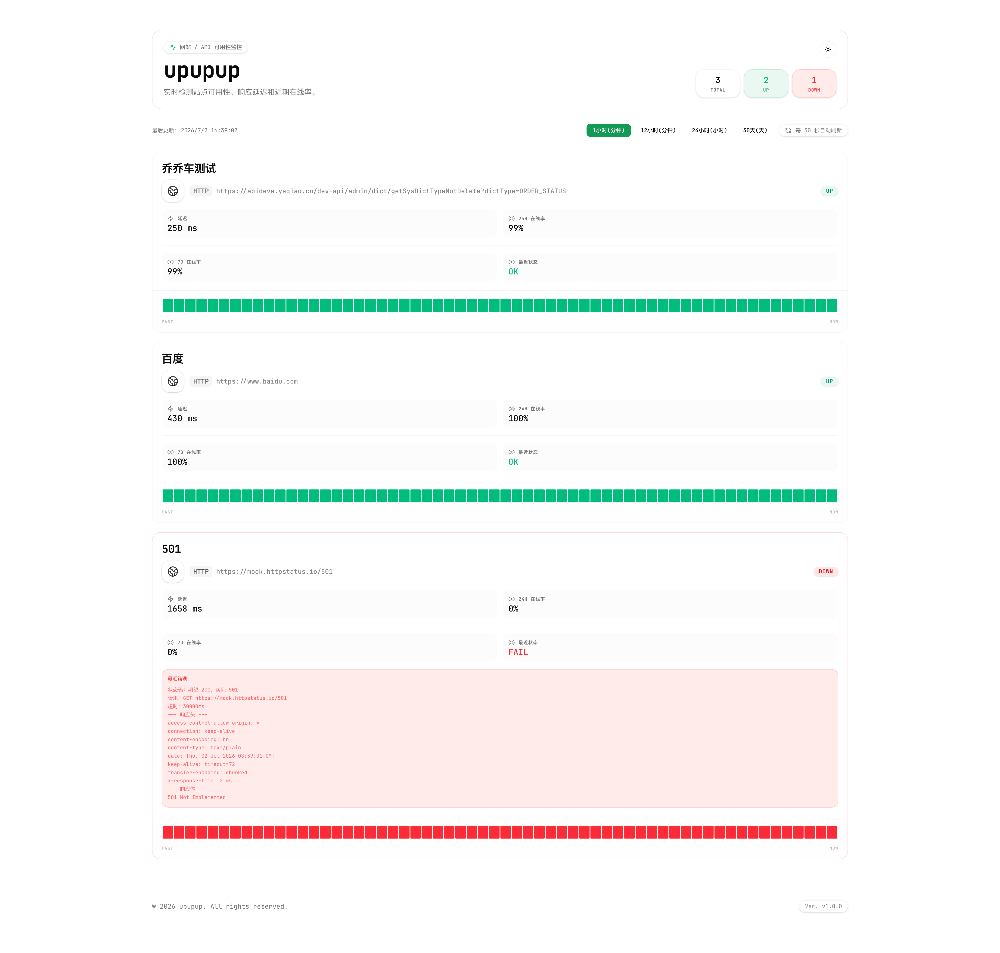
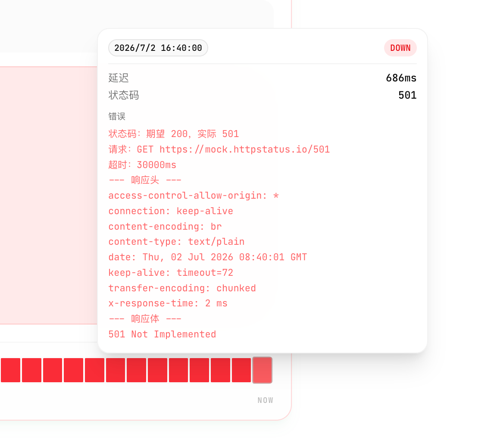
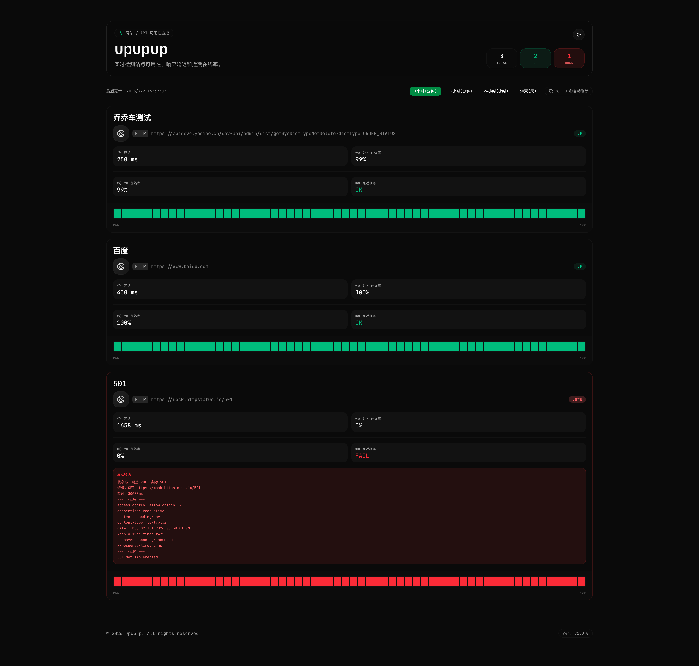

# upupup

English | [中文](README.zh-CN.md)

A lightweight website and API uptime monitoring dashboard. All targets are configured in `.env`, it runs locally with one command, and it does not require any cloud service.

---

## Features

### Real-time monitoring dashboard
- At-a-glance availability overview with Up/Down counts.
- Each monitor card shows the current status, latency, and uptime.
- Dashboard data refreshes automatically every 30 seconds.



### Smart checks
- Validate HTTP status codes with configurable expected statuses.
- Check for required keywords in the response body.
- Configure per-monitor request timeouts.
- Store detailed failure information, including response body, response headers, and request details.

### Multi-range history
- Supports four time ranges:
  - 1 hour, minute-level granularity.
  - 12 hours, minute-level granularity.
  - 24 hours, hour-level granularity.
  - 30 days, day-level granularity.
- Aggregates failures conservatively: if any check fails in a bucket, that bucket is shown as failed.
- Hover over history cells to inspect detailed records.



### Theme switching
- Supports light, dark, and system themes.
- Can automatically switch based on time of day.
- Saves theme preference locally.



---

## Quick Start

### Requirements
- Node.js 20+
- pnpm, npm, or yarn

### 1. Clone or download the project
```bash
git clone <your-repository-url>
cd upupup
```

### 2. Install dependencies
```bash
pnpm install
```

### 3. Configure monitor targets
```bash
cp .env.example .env
```

Edit `.env` and configure your monitor targets:

```env
# Monitor targets as a JSON array.
MONITORS='[
  {
    "name": "My website",
    "url": "https://example.com",
    "keyword": "Welcome"
  },
  {
    "name": "API health check",
    "url": "https://api.example.com/health",
    "method": "GET",
    "expectedStatus": 200,
    "timeout": 30000
  }
]'

# Check interval in seconds. Minimum: 30.
CHECK_INTERVAL_SECONDS=60

# Number of days to retain history.
HISTORY_RETENTION_DAYS=90

# SQLite database file path.
DB_PATH=./data/monitor.db
```

### 4. Start the web and worker processes

Start the web process:

```bash
pnpm dev
```

In another terminal, start the scheduler worker:

```bash
pnpm dev:worker
```

Open http://localhost:3001 to view the dashboard.

---

## Configuration

### `MONITORS`

| Field | Type | Required | Default | Description |
|------|------|----------|---------|-------------|
| `name` | string | Yes | - | Display name for the monitor target. |
| `url` | string | Yes | - | URL to monitor. |
| `method` | string | No | `GET` | HTTP method, such as `GET`, `POST`, or `PUT`. |
| `keyword` | string | No | - | Required keyword in the response body. |
| `expectedStatus` | number | No | `200` | Expected HTTP status code. |
| `timeout` | number | No | `30000` | Request timeout in milliseconds. |

### Other environment variables

| Variable | Default | Description |
|----------|---------|-------------|
| `CHECK_INTERVAL_SECONDS` | `60` | Check interval. Minimum: 30 seconds. |
| `HISTORY_RETENTION_DAYS` | `90` | Number of days to retain historical data. |
| `DB_PATH` | `./data/monitor.db` | SQLite database file path. |
| `PORT` | `3001` | Server port. |

---

## Deployment

### Deploy with PM2

#### 1. Build the project
```bash
pnpm build
```

#### 2. Start the service
```bash
pm2 start ecosystem.config.js
```

Open http://localhost:3001 to view the dashboard.

#### 3. View status and logs
```bash
pm2 status
pm2 logs upupup-web
pm2 logs upupup-worker
```

#### 4. Enable startup on boot
```bash
pm2 save
pm2 startup
```

### Deploy with Docker

#### With docker-compose
```bash
cp .env.example .env
# Edit .env and configure your monitor targets.
docker-compose up -d --build
```

#### With docker
```bash
docker build --target runner -t upupup-web .
docker build --target worker -t upupup-worker .

docker run -d \
  --name upupup-web \
  -p 3001:3001 \
  --env-file .env \
  -v $(pwd)/data:/app/data \
  --restart unless-stopped \
  upupup-web

docker run -d \
  --name upupup-worker \
  --env-file .env \
  -v $(pwd)/data:/app/data \
  --restart unless-stopped \
  upupup-worker
```

Data is persisted in the `./data` directory.

---

## Architecture

### Tech stack
- **Framework**: Next.js 16 App Router
- **Database**: SQLite + better-sqlite3
- **Scheduled jobs**: node-cron
- **UI**: shadcn/ui + Tailwind CSS
- **Theme**: next-themes

### Project structure
```text
upupup/
├── app/
│   ├── api/dashboard/route.ts  # Aggregated dashboard API
│   ├── page.tsx                # Home page
│   ├── layout.tsx              # Layout with theme support
│   └── globals.css
├── components/
│   ├── ui/                     # shadcn/ui components
│   ├── dashboard-view.tsx      # Main dashboard view
│   ├── status-card.tsx         # Monitor card
│   ├── history-grid.tsx        # Historical timeline
│   ├── theme-toggle.tsx        # Theme switcher
│   └── theme-provider.tsx
├── lib/
│   ├── checker.ts              # Check execution
│   ├── cron.ts                 # Scheduled task bootstrap
│   ├── db.ts                   # Database operations
│   ├── runtime-observability.ts # Event-loop delay metrics
│   ├── config.ts               # Configuration parsing
│   └── utils.ts
├── instrumentation.ts          # Web runtime observability hook
├── worker.ts                   # Dedicated scheduler process
├── ecosystem.config.js         # PM2 configuration
├── docker-compose.yml
├── Dockerfile
└── .env
```

### Data flow
```text
.env configuration
  |
worker.ts -> cron.ts starts scheduled checks
  |
checker.ts executes checks -> writes to SQLite
  |
/api/dashboard/route.ts aggregates data
  |
Dashboard UI refreshes every 30 seconds
```
